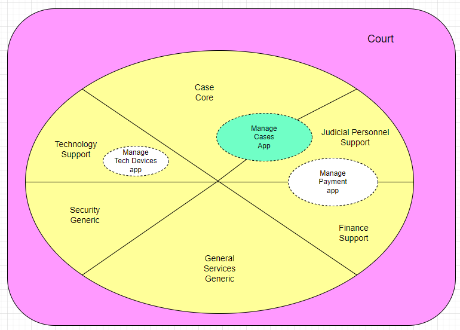
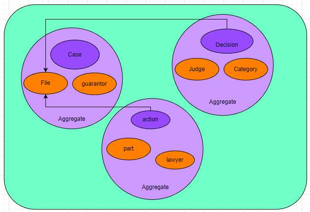
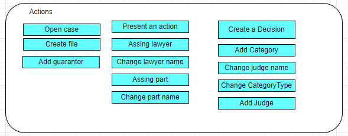
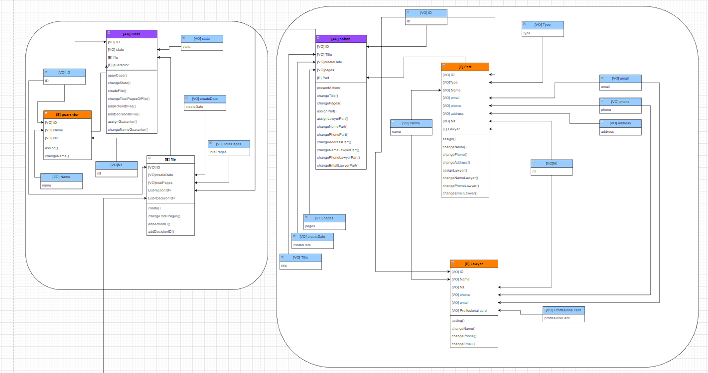
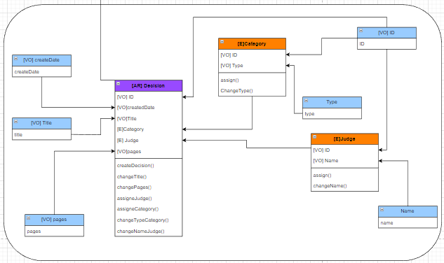
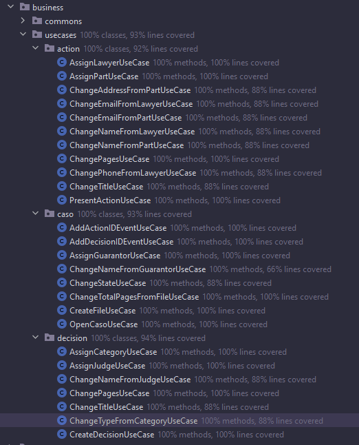

# CourtDDD

## SofkaU Trainig League - DDD Final Challange

### Description

This repository contains a project built in Java, Spring Boot and Maven, that uses Domain Driven Design (DDD) to develop and app for manage and checking cases in a court.

## Big picture, Domain and Subdomains

The previous image represents the big picture for the domain court. There we can find six subdomains with its respective categorization:
- Core: Case is the most important subdomain due to it will connect the court and the public through the cases in order to impart justice.
- Support: Technology, Judicial Personnel, and Finance are the subdomains that, even when they are so important to the court, are no the key part.
- Generic: Security and General subdomains are those subdomains that are necessary for the operation of the court but not fundamental, even they can be provided for a third-party company.
In the image we also can find the three different solutions proposed for different scenarios. For this project the Manage cases app was the solution developed.

### Bounded Context

The previous image represents the 3 aggregate considered to be included in the Bounded context. Case, Decision, and Action are the Aggregate roots, and inside each aggregate you can find the entities. 

### Ubiquitous language 

In the image below you could find the action that could be performance according with the Domain. 

### Domain Model

The previous images show the domain model, how each aggregate root is formatted by its entities and value object related.

## Command driven use cases

- Decision aggregate
    + CreateDecisionUseCase: It is use to generate a new decision.
    + AssignJudgeUseCase: new Judge associate with decision.
    + AssignCategoryUseCase: new category associate with decision.
    + ChangeTitleUseCase: change title in decision.
    + ChangePagesUseCase: change number of decision pages.
    + ChangeNameFromJudgeUseCase: modify name of judge.
    + ChangeTypeFromCategoryUseCase: modify type in category.

- Action aggregate
    + PresentActionUseCase: create an action.
    + AssignPartUseCase: new part associates with action.
    + AssignLawyerUseCase: new lawyer associated with part.
    + ChangeTitleUseCase:  change title in action.
    + ChangePagesUseCase: change number of action pages.
    + ChangeAddressFromPartUseCase: modify address inside part.
    + ChangeEmailFromPartUseCase: modify email inside part.
    + ChangeNameFromPartUseCase: modify name inside part.
    + ChangeEmailFromLawyerUseCase: modify email inside lawyer.
    + ChangeNameFromLawyerUseCase: modify lawyer name.
    + ChangePhoneFromLawyerUseCase: modify lawyer phone.

- Caso aggregate
    + OpenCasoUseCase: create a caso.
    + CreateFileUseCase: create a file related with a caso.
    + AssignGuarantorUseCase: new guarantor associated with caso.
    + ChangeStateUseCase: modify state of caso.
    + ChangeNameFromGuarantorUseCase: modify guarantor's name.
    + ChangeTotalPagesFromFileUseCase: modify number of page in file.

## Event driven uses cases
- AddActionIDEventUseCase: When an action is created associated its ID with a file.
- AddDecisionIDEventUseCase: when a decision is created associated its ID with a file.

## Test Coverage 
